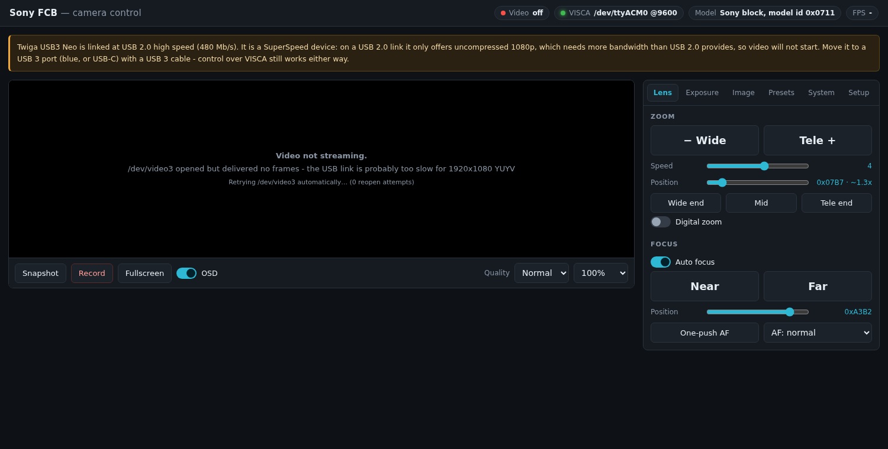

# Sony FCB camera web GUI

Browser control panel for a Sony FCB block camera on a USB interface board.
Video comes from the board's UVC node; every camera function is driven over
VISCA on the board's USB serial port.



## Your hardware (detected 2026-08-30)

| | |
|---|---|
| Interface board | Twiga USB3 NeoHD |
| USB id | `04b4:00f9` on a USB 3 link, `04b4:00f8` when it falls back to USB 2 |
| Video node | `/dev/video3` (changes between plug-ins - the app auto-detects it) |
| VISCA port | `/dev/ttyACM0` at 9600 baud, 8N1 |
| Camera reports | vendor `0x0020` (Sony), model id `0x0711`, ROM `0x0103` |

## Run it

```bash
cd ~/fcb-camera
./run.sh                      # http://localhost:8080
```

Useful flags:

```bash
./run.sh --port 9000                       # different port
HOST=0.0.0.0 ./run.sh                      # reachable from other machines
./run.sh --video /dev/video3 --serial /dev/ttyACM0   # pin the devices
./run.sh --fourcc MJPG --width 1280 --height 720 --fps 30
./run.sh --no-autoconnect                  # start idle, connect from the GUI
./run.sh -v                                # debug logging
```

With no flags it picks the device that looks like an FCB carrier (USB id
first, then device name), and uses the best capture mode that device
advertises - MJPG if offered, otherwise the largest uncompressed mode.

## Important: use a USB 3 port

The NeoHD is a SuperSpeed device. On a USB 2.0 link it enumerates as
`04b4:00f8` and offers only **uncompressed YUYV 1920x1080**, which needs about
1 Gbit/s at 30 fps - far beyond USB 2.0's 480 Mbit/s. The result is a device
that opens but never delivers a frame (`select() timeout`).

VISCA control is unaffected, because it runs over a separate low-rate CDC-ACM
endpoint. So *"zoom works but there is no picture"* almost always means the
board is on a USB 2 link.

Check with:

```bash
cat /sys/bus/usb/devices/*/speed     # want 5000, not 480
lsusb | grep 04b4                    # want 00f9, not 00f8
```

Fix: plug into a blue USB 3 / USB-C port with a USB 3 cable, ideally straight
into the machine rather than through a hub. The board asks for 500 mA, and a
bus-powered hub can brown it out - the log showed one such disconnect after
26 seconds. The GUI shows a banner whenever it detects a USB 2 link.

## Features

**Lens** - zoom in/out (hold, 8 speeds), direct zoom position with approximate
magnification, wide/mid/tele jumps, digital zoom; auto focus toggle, manual
near/far, direct focus position, one-push AF, AF mode.

**Exposure** - AE mode (full auto / manual / shutter / iris / bright), shutter,
iris, gain, gain limit, bright, exposure compensation, backlight compensation,
wide dynamic range, auto slow shutter, high sensitivity. Sliders that the
current AE mode ignores are greyed out automatically.

**White balance** - auto, ATW, indoor, outdoor, one-push (with trigger),
manual, sodium; R and B gain.

**Image** - sharpness, noise reduction, gamma, chroma suppression, picture
effect (B&W / negative), mirror, flip, freeze, stabiliser, defog, IR-cut
removal and auto ICR day/night.

**Presets** - 16 slots, set / recall / reset.

**System** - OSD menu open/close with a navigation pad, power on/standby,
IF_Clear, and a raw VISCA console for anything not exposed as a control.

**Video** - MJPEG stream with quality and scale options, live OSD overlay,
snapshot to `captures/`, AVI recording, fullscreen.

**Keyboard** - `+`/`-` zoom, arrow keys focus, `A` auto focus, `F` one-push AF,
`S` snapshot, `R` record, `0`-`9` recall preset.

## HTTP API

Everything the GUI does is a plain HTTP call, so it scripts easily.

```bash
# state
curl localhost:8080/api/status
curl localhost:8080/api/devices

# control
curl -X POST -H 'Content-Type: application/json' \
     -d '{"value":12288}' localhost:8080/api/visca/zoom_to
curl -X POST -H 'Content-Type: application/json' \
     -d '{"speed":6}' localhost:8080/api/visca/zoom_tele
curl -X POST localhost:8080/api/visca/zoom_stop
curl -X POST -H 'Content-Type: application/json' \
     -d '{"value":"indoor"}' localhost:8080/api/visca/wb_mode

# raw VISCA, hex in and hex out
curl -X POST -H 'Content-Type: application/json' \
     -d '{"value":"81 09 04 47 FF"}' localhost:8080/api/visca/raw

# video
curl localhost:8080/snapshot.jpg -o frame.jpg
curl -X POST localhost:8080/api/capture
curl -X POST localhost:8080/api/record/start
curl -X POST localhost:8080/api/record/stop
```

`GET /stream.mjpg?quality=80&scale=1.0` is the MJPEG stream. It works as an
`` source anywhere, including OBS or VLC.

Any continuous move (`zoom_tele`, `focus_near`, ...) is stopped automatically
after 2.5 s unless refreshed, so a closed browser tab can never leave the lens
driving.

## Files

| File | Purpose |
|---|---|
| `app.py` | Flask server, REST API, MJPEG streaming, recording |
| `visca.py` | VISCA protocol driver and the FCB command set |
| `camera.py` | Capture worker with stall detection and auto-reopen |
| `devices.py` | Device discovery and V4L2 enumeration via raw ioctls |
| `static/` | The web GUI |
| `99-fcb-camera.rules` | Optional udev rule for stable names and permissions |

`devices.py` runs standalone as a probe:

```bash
python3 devices.py     # JSON: nodes, formats, sizes, rates, warnings
```

## Permissions

You are already in `video` and `dialout`, so no setup is needed. On another
machine:

```bash
sudo usermod -aG video,dialout $USER      # log out and back in
sudo cp 99-fcb-camera.rules /etc/udev/rules.d/
sudo udevadm control --reload && sudo udevadm trigger
```

The rule also creates stable `/dev/fcb-visca` and `/dev/fcb-video*` symlinks.

## Troubleshooting

**Zoom works, no picture** - USB 2 link, see above.

**"no VISCA response"** - the port exists but nothing answers. The app already
tries 9600 / 38400 / 19200 / 115200. If all fail, check the block's VISCA baud
DIP or menu setting, and that the board is in VISCA pass-through mode.

**Video keeps reopening** - the worker reopens after 5 s without a frame; a
rising `reopens` count in `/api/status` means the link is dropping. Try a
different cable or port.

**Camera answers but ignores a command** - not every FCB model supports every
command. A `command not executable` error in the toast means that model
rejected it; `bright` inquiry, for example, returns nothing on this unit and
shows as `null`.

**Model id shows as a number** - the model-id table in `visca.py` does not have
an entry for `0x0711`. Control is unaffected; add the name to `FCB_MODELS` if
you want it displayed.

## Notes

The magnification next to the zoom slider is approximate - it interpolates a
per-lens curve selected in **Setup -> Lens type**. The raw VISCA position next
to it is exact.
